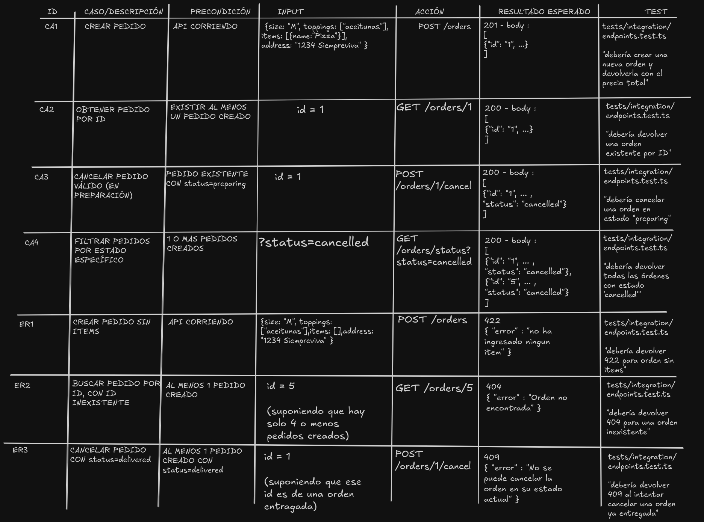

# API de Pedidos de Pizzería

Mini-proyecto para gestionar pedidos de una pizzería.

## Tecnologías de testing utilizadas:
- Jest
- Supertest

## Instalación y ejecución

```bash
# Instalar dependencias
npm install

# Compilar TypeScript
npm run build

# Ejecutar 
npm run dev

# Ejecutar tests (unitarios e integración)
npm run test
```

---

## Scripts en package.json

```json
"scripts": {
  "dev": "node --watch ./dist/index.js",
  "build": "npx tsc --watch",
  "test": "jest"
}
```

---

## Ejemplos `curl`

### Crear un pedido

```bash
curl -X POST http://localhost:3000/orders \
  -H "Content-Type: application/json" \
  -d '{
    "size": "M",
    "toppings": ["queso extra", "pepperoni"],
    "items": [{ "name": "Pizza" }],
    "address": "1234 Siempreviva"
  }'
```


### Obtener un pedido

```bash
curl http://localhost:3000/orders/1
```

### Cancelar un pedido

```bash
curl -X POST http://localhost:3000/orders/1/cancel
```

### Filtrar por estado

```bash
curl "http://localhost:3000/orders/status?status=preparing"
```

---

## Matriz de Casos de Prueba



---

## Reglas de TDD aplicadas

1. Escribir primero el test del servicio → **rojo**
2. Implementar lo mínimo → **verde**
3. Agregar test de integración → **rojo → verde**
4. Refactorizar manteniendo tests verdes
5. Repetir para cada endpoint o historia

---

## User Stories

1. Como cliente, quiero crear un pedido con tamaño, toppings, items y dirección.
2. Como cliente, quiero obtener un pedido por su ID para ver su estado y detalles.
3. Como cliente, quiero poder cancelar un pedido si aún no ha sido entregado.
4. Como cliente, quiero filtrar los pedidos por estado (preparing, delivered, cancelled) para ver su progreso.
5. Como cliente, quiero obtener una lista de todos los pedidos.
